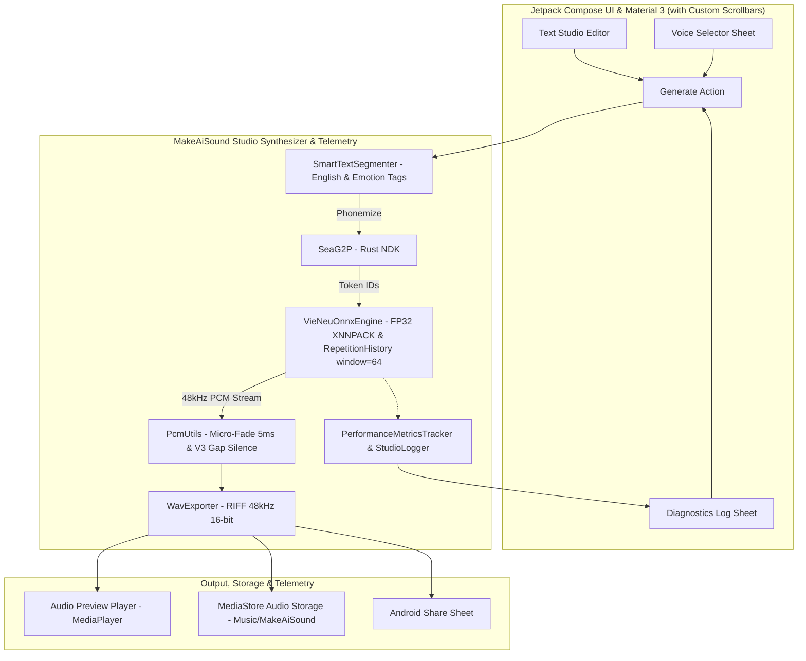

# 💡 BRIEF: MakeAiSound - AI Voice Studio & Text-to-Audio Generator

**Ngày cập nhật:** 2026-08-23  
**Dự án:** MakeAiSound (`D:\skul9x\MakeAiSound`)  
**Tham khảo cốt lõi:** `D:\skul9x\DocTruyenApk-main` & `D:\skul9x\VieNeu-TTS-main`  
**Nền tảng:** Android (Kotlin, Jetpack Compose, Material Design 3)  
**Thiết bị mục tiêu:** OnePlus 13R (Snapdragon 8 Gen 3, 120Hz ProXDR 1.5K) & Android 10 – 15  
**Lõi AI:** VieNeu-TTS v3 Turbo (FP32 Studio Quality On-Device) & sea-g2p Rust NDK  

---

## 1. VẤN ĐỀ & MỤC TIÊU SẢN PHẨM (CORE VALUE)

### 📌 Bối cảnh & Mục đích:
* Ứng dụng **MakeAiSound** được xây dựng với mục tiêu: **Tạo ra file âm thanh giọng đọc AI tiếng Việt chất lượng cao nhất, tự nhiên nhất, nhanh chóng và tiện lợi**.
* **Không yêu cầu realtime streaming phức tạp** (như ứng dụng đọc truyện dài tập), mà tập trung vào **Batch Studio Synthesis**: Người dùng soạn/dán text $\rightarrow$ Bấm tạo $\rightarrow$ AI sinh toàn bộ âm thanh chất lượng Studio $\rightarrow$ Nghe thử & Lưu file WAV để làm video, podcast, lồng tiếng...
* **100% Offline On-Device AI:** Chạy trực tiếp trên phần cứng máy qua ONNX Runtime, không phụ thuộc mạng, không tốn phí API, không lo lộ dữ liệu.
* **Hệ thống Telemetry & Diagnostic Logging:** Ghi nhận toàn bộ chỉ số vận hành (RTF, thời gian G2P/Prefill/Decode/Codec, RAM, event logs) để phục vụ phân tích hiệu năng và xử lý lỗi tiềm ẩn.

---

## 2. 🌟 5 KỸ THUẬT TIÊN TIẾN TÍCH HỢP TỪ `VieNeu-TTS-main`:

1. 🔄 **Sliding-Window Repetition Penalty (`RepetitionHistory` với `window = 64 frames` ~2.5s @ 25fps):**
   * Khắc phục triệt để lỗi méo tiếng / trôi giọng ở cuối các đoạn văn dài bằng cách chỉ phạt các token lặp lại trong 2.5s gần nhất thay vì phạt vĩnh viễn cả bảng mã.
2. ⏱️ **Giới Hạn Frame Động Tránh Nói Nhảm (`max_expected_frames` & `SINGLE_WORD_MAX_FRAMES = 13` ~1.0s):**
   * Ngăn chặn hoàn toàn hiện tượng sinh âm đuôi thừa (hallucination) khi đọc câu ngắn hoặc từ đơn.
3. 🎭 **Nhận Diện Thẻ Cảm Xúc Biểu Cảm (Emotion Tokens):**
   * Tự động nhận diện `[cười]` / `[chuckle]` $\rightarrow$ `<|emotion_1|>`, `[thở dài]` / `[sigh]` $\rightarrow$ `<|emotion_2|>`, `[hắng giọng]` $\rightarrow$ `<|emotion_3|>`.
4. 🔠 **Bảo Vệ Từ Tiếng Anh Trong Văn Bản Tiếng Việt (`<en>...</en>`):**
   * Giữ nguyên các cụm từ tiếng Anh nguyên khối trong quá trình phân đoạn câu để không bị ngắt gãy vụn ngữ âm.
5. 🔇 **Khoảng Lặng Tự Nhiên Chuẩn V3 (`V3_GAP_SILENCE`):**
   * Chuẩn hóa nhịp ngắt nghỉ: $350\text{ms}$ chuyển đoạn, $180\text{ms}$ hết câu, $40\text{ms}$ dấu phẩy kết hợp Micro-Fade 5ms.

---

## 3. 🧠 LÝ DO LỰA CHỌN FP32 & ĐỊNH DẠNG WAV 48KHZ

### 💎 Tại sao nên dùng FP32 (Full Precision)?
1. **Chất lượng âm thanh tuyệt đối:** FP32 giữ nguyên 100% độ chính xác số thực của các tầng Transformer và Codec, không bị hiện tượng méo tiếng, nhiễu âm gió (quantization noise/artifacts) như INT8.
2. **Sức mạnh Snapdragon 8 Gen 3 trên OnePlus 13R:**
   * Snapdragon 8 Gen 3 sở hữu cụm nhân siêu khủng (1x Cortex-X4 @ 3.3GHz + 5x Cortex-A720 @ 3.2GHz) với tập lệnh ARM NEON FP32 cực mạnh.
   * Khi chạy với XNNPACK đa luồng, tốc độ xử lý FP32 vẫn cực nhanh (**RTF ~0.2x – 0.3x**, chỉ mất ~2s để sinh đoạn audio 10s).
   * Do app hướng tới mục đích xuất audio hay và chuẩn studio, **FP32 là lựa chọn tối ưu nhất**.

### 🎵 Định dạng chuẩn: WAV 16-bit PCM 48kHz (Lossless)
* Tần số lấy mẫu gốc của VieNeu-TTS là **48,000 Hz** (chuẩn âm thanh phòng thu chuyên nghiệp).
* Đóng gói trực tiếp ra container **WAV RIFF**, giữ nguyên chất lượng gốc không nén, tương thích ngay lập tức với CapCut, Premiere, TikTok, v.v.

---

## 4. 🎙️ DANH SÁCH GIỌNG ĐỌC AI (VIENEU-TTS PRESETS)

Kế thừa toàn bộ 8 giọng đọc đặc trưng từ `VieNeu-TTS` / `DocTruyen`:
1. 👩 **Trúc Ly** (Nữ • Miền Bắc • Truyện cảm xúc / Tự nhiên) — *Mặc định*
2. 👨 **Minh Đức** (Nam • Miền Bắc • Trầm ấm / Tin tức)
3. 👨 **Phạm Tuyên** (Nam • Miền Bắc • Truyền cảm, sâu lắng)
4. 👨 **Thái Sơn** (Nam • Miền Trung • Rõ ràng, dứt khoát)
5. 👨 **Xuân Vĩnh** (Nam • Miền Nam • Ấm áp, gần gũi)
6. 👩 **Thanh Bình** (Nữ • Miền Nam • Dịu dàng, trong trẻo)
7. 👩 **Ngọc Linh** (Nữ • Miền Bắc • Nhẹ nhàng, mượt mà)
8. 👩 **Đoan Trang** (Nữ • Miền Nam • Sang trọng, tin tức)
* *Tùy chọn phụ:* Hỗ trợ fallback sang Google TTS giọng hệ thống Android khi cần.

---

## 5. 📱 TỐI ƯU GIAO DIỆN, SCROLLBAR & TRẢI NGHIỆM CHO ONEPLUS 13R

| Đặc tính OnePlus 13R | Tối ưu hóa trong MakeAiSound |
| :--- | :--- |
| **Màn hình 6.78" 1.5K 120Hz ProXDR** | • Giao diện Jetpack Compose render mượt mà ở **120 FPS**. • Typography sắc nét chuẩn mật độ 450 PPI. • Dark Theme **OLED Midnight Black (`#0B0E14`)** kết hợp dải màu Neon Cyan & Violet hiện đại, siêu tiết kiệm pin. |
| **Thanh cuộn Scrollbar tùy biến** | • **Thanh Scrollbar hiển thị rõ nét trên mọi màn hình:** Main Studio Screen, Voice Picker BottomSheet, và Diagnostics Log Viewer. • Giúp định vị và cuộn nội dung dài dễ dàng trên màn hình dài 19.8:9. |
| **Tỷ lệ màn hình 19.8:9 (Thumb-zone)** | • Toàn bộ các nút hành động cốt lõi (*Tạo âm thanh, Nghe thử, Lưu file WAV, Dán text*) được gom về nửa dưới màn hình để thao tác một tay cực kỳ thuận tiện. |
| **Kiến trúc Batch Studio Synthesis** | • Quy trình tạo âm thanh rõ ràng, hiển thị thanh tiến trình % trực quan (Phân tích câu $\rightarrow$ AI Inference $\rightarrow$ Đóng gói WAV). |

---

## 6. 🎨 CHI TIẾT TÍNH NĂNG (FEATURE BREAKDOWN)

### 🚀 MVP (Giai đoạn 1 - Trọng tâm):
1. **Text Studio (Soạn thảo văn bản):**
   * Ô nhập văn bản đa dòng (hỗ trợ nhập, sửa, bôi đen, sao chép, nhận diện thẻ cảm xúc `[cười]`, `[thở dài]`).
   * Nút **"Dán từ Clipboard"** (Paste 1-chạm) tiện lợi.
   * Nút **"Sao chép"** (Copy) & **"Xóa nhanh"** (Clear text).
   * Bộ đếm ký tự thời gian thực và thời lượng dự kiến.
2. **Voice Selector (Bộ chọn giọng đọc):**
   * Thẻ hiển thị giọng đang chọn (Avatar, Tên, Giới tính, Vùng miền, Phong cách).
   * BottomSheet chọn giọng với thanh scrollbar và bộ lọc Vùng miền & Giới tính.
   * Nút nghe thử mẫu giọng (Preview Sample).
3. **Studio Audio Generator (Engine Tạo Âm Thanh):**
   * Nút bấm chính **"✨ Tạo âm thanh (WAV 48kHz)"** nổi bật.
   * Hiển thị tiến trình sinh âm thanh (Progress % và trạng thái xử lý từng câu).
   * Hỗ trợ nút Hủy (Cancel) giữa chừng nếu cần.
4. **Studio Audio Player (Trình phát & Xuất File):**
   * Sóng âm động (Animated Waveform Visualizer).
   * Điều khiển phát: Play / Pause / Replay / Tua thanh thời gian (Scrubber).
   * Nút **"🎧 Nghe thử"** phát lại tức thì.
   * Nút **"💾 Lưu file WAV"** lưu trực tiếp vào thư mục `Music/MakeAiSound` qua Android MediaStore API (không cần cấp quyền nhạy cảm).
   * Nút **"📤 Chia sẻ"** chuyển file sang các ứng dụng khác.
5. **Telemetry & Diagnostics Log Viewer (Xem & Xuất Log):**
   * Nút mở màn hình xem Log chẩn đoán ngay trên thanh công cụ.
   * Hiển thị thống kê chỉ số: Số chunk, RTF trung bình, thời gian G2P/Prefill/Decode/Codec, RAM tiêu thụ.
   * Danh sách log màu theo cấp độ (INFO, SYNTHESIS, STORAGE, ERROR) kèm thanh scrollbar.
   * Nút **"Sao chép Log"** vào bộ nhớ tạm để gửi phân tích hoặc fix lỗi.

### 🎁 Phase 2 (Nâng cao):
* Danh sách lịch sử các file âm thanh đã xuất (Audio Library).
* Tùy chỉnh tốc độ đọc (0.8x – 1.5x) và cao độ (Pitch).

---

## 7. 🏛️ KIẾN TRÚC KỸ THUẬT

---

## 8. ➡️ BƯỚC TIẾP THEO
* Tiến hành triển khai từng Phase theo đúng quy trình **/code** và chạy duy nhất 1 bài test sau mỗi Phase.
